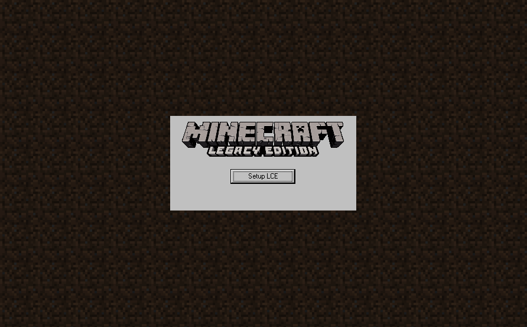

# LCE Launcher

## Introduction

This is a Java launcher for [MinecraftConsoles](https://github.com/smartcmd/MinecraftConsoles)/Minecraft Legacy Edition that recreates the look and feel of the OG Minecraft launcher

> [!NOTE]
> I will only be supporting the MinecraftConsoles repo for now   Other forks of MinecraftConsoles or the LCE leaked builds  might not work properly

## Platform Support

- **Windows**: This project is windows exclusive at the moment, as you cannot build LCE outside of Windows

## Download

Head over to the [Releases](https://github.com/noelledotjpg/LCE-Launcher/releases) to download a JAR!

> [!WARNING]
> Beware of bugs or unexpected behaviour! This is still really early into development, but it has the bare minimum to work as a launcher!   

## Features

- **First-time setup wizard** - clones the MinecraftConsoles repo, runs CMake and MSBuild, and creates a desktop shortcut, all from inside the launcher
- **Profile management** - create, rename, and delete profiles with playtime tracking
- **Server management** - add, edit, and remove servers saved to the game's binary `servers.db` format
- **World management** - browse your saves with thumbnails, world name, game mode, seed, size and creation date. Rename worlds and change game mode directly from the launcher (edits `saveData.ms` on disk)
- **News/update notes tab**
- **Console log viewer**

# Build/Run

### Requirements: 
**Building Launcher**
- An IDE such as Intellij IDEA
- Java 21 JDK (Preferrably [Eclipse Temurin](https://adoptium.net/temurin/releases?version=21&os=any&arch=any))
- Gradle (optional, can use the Gradle wrapper included)
 

**Building LCE (Setup)**
- [Visual Studio 2022](https://aka.ms/vs/17/release/vs_community.exe)
- [CMake](https://cmake.org/download/#latest) 

